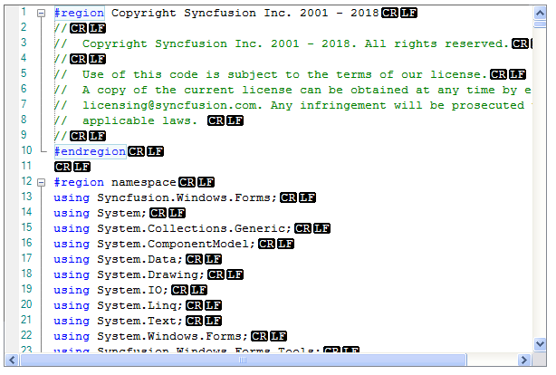

# How to Customize the End-of-Line Style in WinForms EditControl
This repository demonstrates how to customize the **end-of-line style** in the Syncfusion WinForms **EditControl**. The EditControl is a powerful text editor component that supports syntax highlighting, code editing, and advanced customization options. By default, the control displays a standard end-of-line marker, but developers may want to modify its appearance to match application themes or improve readability.

## Why Customize End-of-Line Style?
Customizing the end-of-line style can help developers:
- Provide visual cues for line endings in code editors.
- Improve clarity when working with files that contain mixed line endings.
- Enhance the overall user experience by aligning with custom themes.

## Key Features Demonstrated in This Sample
- Change the end-of-line marker style programmatically.
- Apply custom colors and shapes to the marker.
- Update styles dynamically based on user preferences or application themes.

## Code Example
```C#
public partial class Form1 : Form
{
    private Syncfusion.Windows.Forms.Edit.EditControl editControl1;
    private Syncfusion.Windows.Forms.Tools.ComboBoxAdv comboboxAdv1;

    public Form1()
    {
        InitializeComponent();

        // Initialize EditControl
        editControl1 = new Syncfusion.Windows.Forms.Edit.EditControl
        {
            Location = new Point(20, 100),
            Size = new Size(600, 400),
            BackColor = Color.White,
            ShowEndOfLine = true,
            BorderStyle = BorderStyle.FixedSingle,
            Dock = DockStyle.Fill,
            ShowVerticalSplitters = false,
            ShowHorizontalSplitters = false,
            DefaultNewLineStyle = Syncfusion.IO.NewLineStyle.Windows
        };

        editControl1.LoadFile();
        this.panel2.Controls.Add(editControl1);

        // Initialize ComboBoxAdv for selecting newline style
        comboboxAdv1 = new Syncfusion.Windows.Forms.Tools.ComboBoxAdv
        {
            Location = new Point(this.checkBox1.Location.X, this.checkBox1.Location.Y + 50),
            Size = new Size(120, 80)
        };

        comboboxAdv1.Items.AddRange(new string[] { "Windows", "Mac", "Unix", "Control" });
        comboboxAdv1.SelectedIndex = 0;
        comboboxAdv1.SelectedIndexChanged += ComboboxAdv1_SelectedIndexChanged;
        this.panel1.Controls.Add(comboboxAdv1);
    }

    private void ComboboxAdv1_SelectedIndexChanged(object sender, EventArgs e)
    {
        switch ((sender as ComboBoxAdv).SelectedIndex)
        {
            case 0:
                editControl1.SetNewLineStyle(Syncfusion.IO.NewLineStyle.Windows);
                break;
            case 1:
                editControl1.SetNewLineStyle(Syncfusion.IO.NewLineStyle.Mac);
                break;
            case 2:
                editControl1.SetNewLineStyle(Syncfusion.IO.NewLineStyle.Unix);
                break;
            case 3:
                editControl1.SetNewLineStyle(Syncfusion.IO.NewLineStyle.Control);
                break;
        }
    }

    private void checkBox1_CheckedChanged(object sender, EventArgs e)
    {
        editControl1.ShowEndOfLine = checkBox1.Checked;
    }
}
```

## Output

